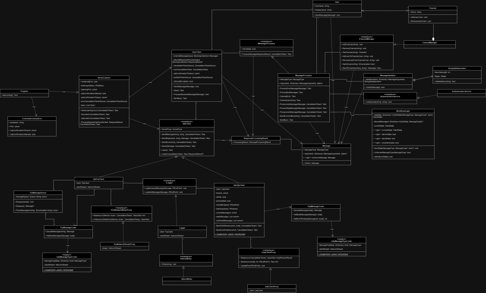

# IPK Project 2(IOTA: Chat server)

A chat server, that allows clients to communicate with each other over udp or tcp protocols.

## Usage 

### Compilation

```bash
make
```
Executable ```ipk24chat-server``` will be created in the root of the project
### Commandline options

* ```-l``` - Server listening IP address for welcome sockets (default is 0.0.0.0)
* ```-p``` - Server listening port for welcome sockets (default is 4567)
* ```-d``` - UDP confirmation timeout (default is 250)
* ```-r``` - Maximum number of UDP retransmissions (default is 3)
* ```-h``` - Prints program help output

### Example of usage

```bash
./ipk24chat-server -l 127.0.0.1 -p 4000 -d 300
```

Starts a server, that listens on the address 127.0.0.1 with the port 400 and timeout for udp confimation 300 ms

## Implementation

### Program flow

At first command line options are parsed to get `CommandLineOptions` object, properties of which are later supplied to the constructor of `ServerListener`. Then `ServerListener::StartListeningAsync()` method is called, that starts listening for incoming first tcp and udp messages in the parallel tasks. In case of udp the udp implementation of `IIpkClient` interface is created in the beginning of listening and after the first message listening port for that client is randomized to accept other new clients on the provided listening port. The tcp variant of `IIpkClient` is created while accepting incoming tcp request. The first received message from a client is later sent to `ProcessRequest` method, where in case of invalid message ERR message with following BYE is sent back. In case of valid message, `UserClient` object is created for interracting with the client. The retrieved message is later sent to the created `UserClient` object for Its processing. Then the `ServerListener` object listens for the other first messages and the process repeats itself. 

<br/>

In the created `UserClient` object, 3 tasks are created for listening, processing and sending messages from another client or server purposes. When the message is accepted from the client in the listening tasks, It's later sent to the processing task via `BlockingCollection`. Meanwhile in the processing task the message is retrieved from `BlockingCollection` and sent to `MessageProcessor::ProcessMessage`, where based on the message type and the interraction state(processing is perfomed by `WorkflowGraph` object), the respective action is committed. In case of AUTH message object that implements `IAuthenticationService` checks for the valid credentials, `ChannelManager` object adds user to the default channel and sends message to clients, that are in the mentioned channel, about the user joining the channel. If the JOIN message is got, user is removed from the last channel, its each member is informed about the user leaving, user is then added to the channel with the channel id provided in the message and all the channel's memebers are informed about the user entering the channel. If the message is invalid or is not supposed to be sent in the current state, ERR with following BYE is sent. After sent or received BYE, all the client related resources together with tasks are disposed. 

### Class diagram



## Testing

